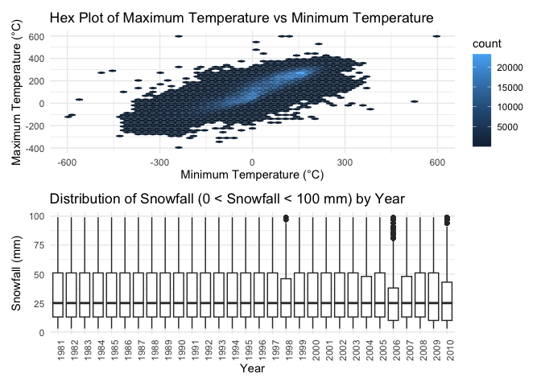
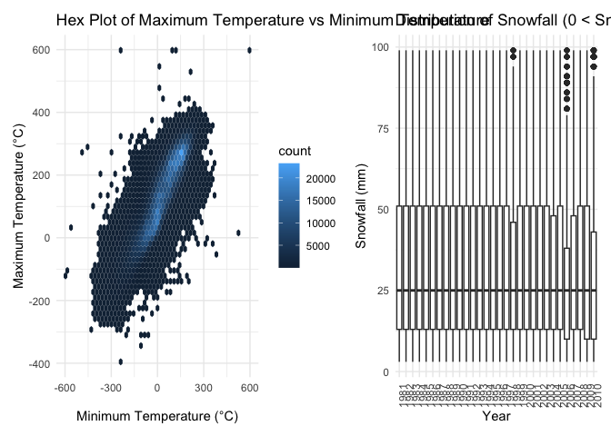

p8105_hw3_tc3326
================
KK Chen
2024-10-16

# Problem 2

## Import and Organize data sets

``` r
library(tidyverse)
```

    ## ── Attaching core tidyverse packages ──────────────────────── tidyverse 2.0.0 ──
    ## ✔ dplyr     1.1.4     ✔ readr     2.1.5
    ## ✔ forcats   1.0.0     ✔ stringr   1.5.1
    ## ✔ ggplot2   3.5.1     ✔ tibble    3.2.1
    ## ✔ lubridate 1.9.3     ✔ tidyr     1.3.1
    ## ✔ purrr     1.0.2     
    ## ── Conflicts ────────────────────────────────────────── tidyverse_conflicts() ──
    ## ✖ dplyr::filter() masks stats::filter()
    ## ✖ dplyr::lag()    masks stats::lag()
    ## ℹ Use the conflicted package (<http://conflicted.r-lib.org/>) to force all conflicts to become errors

``` r
nhanes_accel <- read_csv("./data/nhanes_accel.csv") %>%
  janitor::clean_names()
```

    ## Rows: 250 Columns: 1441
    ## ── Column specification ────────────────────────────────────────────────────────
    ## Delimiter: ","
    ## dbl (1441): SEQN, min1, min2, min3, min4, min5, min6, min7, min8, min9, min1...
    ## 
    ## ℹ Use `spec()` to retrieve the full column specification for this data.
    ## ℹ Specify the column types or set `show_col_types = FALSE` to quiet this message.

``` r
nhanes_covar <- read_csv("./data/nhanes_covar.csv", skip = 4)%>%
 set_names(c("seqn", "sex", "age", "BMI", "education")) %>%

mutate(
    seqn = as.integer(seqn),
    sex = factor(sex, levels = c(1, 2), labels = c("Male", "Female")),
    age = as.numeric(age),
    BMI = as.numeric(BMI),
    education = factor(education, levels = c(1, 2, 3), labels = c("Less than     high school", "High school equivalent", "More than high school"))
      ) %>%
  filter(age >= 21) %>%
  drop_na(sex, age, BMI, education)
```

    ## Rows: 250 Columns: 5
    ## ── Column specification ────────────────────────────────────────────────────────
    ## Delimiter: ","
    ## dbl (5): SEQN, sex, age, BMI, education
    ## 
    ## ℹ Use `spec()` to retrieve the full column specification for this data.
    ## ℹ Specify the column types or set `show_col_types = FALSE` to quiet this message.

``` r
merged_data <- nhanes_accel %>%
  inner_join(nhanes_covar, by = "seqn")
```

## Produce a reader-friendly table for the number of men and women in each education category

``` r
merged_data %>%
  group_by(sex, education) %>%
  summarize(count = n(), .groups = 'drop') %>%
  pivot_wider(names_from = sex, values_from = count, values_fill = 0) %>%
  knitr::kable()
```

| education              | Male | Female |
|:-----------------------|-----:|-------:|
| Less than high school  |   27 |     28 |
| High school equivalent |   35 |     23 |
| More than high school  |   56 |     59 |

Comments: This table shows that both men and women in the dataset tend
to have higher education levels, with the “More than high school” group
having the highest representation for both genders. However, men are
more prevalent in the “High school equivalent” category, while the “Less
than high school” group shows an almost equal gender distribution.

## Create a visualization of the age distributions for men and women in each education category

``` r
ggplot(merged_data, aes(x = education, y = age, fill = sex)) +
  geom_boxplot(alpha = 0.7) +
  labs(
    title = "Age Distributions by Sex and Education Level",
    x = "Education Level",
    y = "Age",
    fill = "Sex"
  ) +
  theme_minimal() +
  theme(legend.position = "bottom")
```

<!-- -->
Comments: Participants with less education tend to be older, with the
“less than high school” group having the oldest participants on average.
In contrast, the “more than high school” group includes younger
participants.

In High School Equivalent,women in this group tend to be slightly older
than men, with a median age closer to 60 for women and around 55 for
men.Most women are of similar ages (closer to the median), while men
show more variability.

In More than High school, it shows the most diverse age distribution for
both men and women. It suggests that people with more than a high school
education come from a broad range of age groups.The median age for both
men and women is around 41 years, indicating that the central tendency
is similar for both genders in this education level.

## Aggregate and create a total activity variable for each participant. Plot these total activities (y-axis) against age (x-axis)

``` r
activity_age_plot <- merged_data %>%
  mutate(total_activity = rowSums(across(min1:min1440), na.rm = TRUE)) %>%
  ggplot(aes(x = age, y = total_activity, color = sex)) +
  geom_point(alpha = 0.6) +
  geom_smooth(se = FALSE) +
  facet_grid(.~ education) +
  labs(
    title = "Total Activity By Age and Education Level and Sex",
    x = "Age",
    y = "Total Activity (MIMS)",
    color = "Sex"
  ) +
  theme_minimal() +
  theme(legend.position = "bottom")

print(activity_age_plot)
```

    ## `geom_smooth()` using method = 'loess' and formula = 'y ~ x'

<!-- -->
Comment: All groups show a decline in activity with age, participants
with higher education maintain higher levels of activity into older age.
In the “Less than high school” group, physical activity decreases with
age for both men and women, particularly after age 60. In the “High
school equivalent” group, middle age women generally have higher
activity than middle age men. Activity decreases for women and men after
age 40. In the “More than high school” group, activity trends are
relatively stable across age, with men and women displaying similar
activity patterns throughout the lifespan. However, women tend to have
slightly higher activity levels than men overall. After the age of 60,
both men and women experience a gradual decrease in total activity. The
decline is more gradual compared to those with lower education levels.

## Make a three-panel plot that shows the 24-hour activity time courses for each education level and use color to indicate sex

``` r
merged_data <- merged_data %>%
  pivot_longer(cols = min1:min1440, names_to = "minute", values_to = "activity") %>%
  mutate(minute = as.numeric(gsub("min", "", minute))) %>%
  group_by(education, sex, minute) %>%
  summarize(mean_act = mean(activity, na.rm = TRUE), .groups = 'drop')
```

``` r
Hour_course_plot <- merged_data %>%
  ggplot(aes(x = minute, y = mean_act, color = sex)) +
  geom_line(alpha = 0.3) +
  geom_smooth(se = FALSE) +
  facet_grid(.~ education) +
  labs(
    title = "24-Hour Activity Time Courses by Education Level and Sex",
    x = "Minute of the Day",
    y = "Mean Activity",
    color = "Sex"
  ) +
  theme_minimal() +
  theme(legend.position = "bottom")

print(Hour_course_plot)
```

    ## `geom_smooth()` using method = 'gam' and formula = 'y ~ s(x, bs = "cs")'

<!-- -->
Comments:

Across all education levels, activity peaks in the morning (around 8
a.m.) and declines in the evening. Women generally show higher activity
levels, especially in the “High school equivalent” and “More than high
school” groups.

Less than High School: Lower overall activity. There is a sharp peak in
the morning and a steady decline throughout the day. Men show slightly
higher activity than women.

High School Equivalent: Higher and more sustained activity levels than
the Less than High School group. Women tend to have higher activity than
men, especially during mid-day.

More than High School: This group has the highest activity levels
throughout the day, with women consistently more active than men.

# Problem 3

## Import and clean datasets

``` r
library(tidyverse)
library(janitor)
```

    ## 
    ## Attaching package: 'janitor'

    ## The following objects are masked from 'package:stats':
    ## 
    ##     chisq.test, fisher.test

``` r
combined_data <- read_csv("./data/Jan 2020 Citi.csv") %>%
  mutate(month = "jan", year = 2020) %>%
  clean_names() %>%
  bind_rows(
    read_csv("./data/July 2020 Citi.csv") %>%
      mutate(month = "jul", year = 2020) %>%
      clean_names(),
    read_csv("./data/Jan 2024 Citi.csv") %>%
      mutate(month = "jan", year = 2024) %>%
      clean_names(),
    read_csv("./data/July 2024 Citi.csv") %>%
      mutate(month = "jul", year = 2024) %>%
      clean_names()
  ) %>%
  distinct() 
```

    ## Rows: 12420 Columns: 7
    ## ── Column specification ────────────────────────────────────────────────────────
    ## Delimiter: ","
    ## chr (6): ride_id, rideable_type, weekdays, start_station_name, end_station_n...
    ## dbl (1): duration
    ## 
    ## ℹ Use `spec()` to retrieve the full column specification for this data.
    ## ℹ Specify the column types or set `show_col_types = FALSE` to quiet this message.
    ## Rows: 21048 Columns: 7
    ## ── Column specification ────────────────────────────────────────────────────────
    ## Delimiter: ","
    ## chr (6): ride_id, rideable_type, weekdays, start_station_name, end_station_n...
    ## dbl (1): duration
    ## 
    ## ℹ Use `spec()` to retrieve the full column specification for this data.
    ## ℹ Specify the column types or set `show_col_types = FALSE` to quiet this message.
    ## Rows: 18861 Columns: 7
    ## ── Column specification ────────────────────────────────────────────────────────
    ## Delimiter: ","
    ## chr (6): ride_id, rideable_type, weekdays, start_station_name, end_station_n...
    ## dbl (1): duration
    ## 
    ## ℹ Use `spec()` to retrieve the full column specification for this data.
    ## ℹ Specify the column types or set `show_col_types = FALSE` to quiet this message.
    ## Rows: 47156 Columns: 7
    ## ── Column specification ────────────────────────────────────────────────────────
    ## Delimiter: ","
    ## chr (6): ride_id, rideable_type, weekdays, start_station_name, end_station_n...
    ## dbl (1): duration
    ## 
    ## ℹ Use `spec()` to retrieve the full column specification for this data.
    ## ℹ Specify the column types or set `show_col_types = FALSE` to quiet this message.

``` r
obs <- combined_data %>%
  nrow()
summary(combined_data)
```

    ##    ride_id          rideable_type        weekdays            duration      
    ##  Length:99485       Length:99485       Length:99485       Min.   :  1.002  
    ##  Class :character   Class :character   Class :character   1st Qu.:  5.595  
    ##  Mode  :character   Mode  :character   Mode  :character   Median :  9.839  
    ##                                                           Mean   : 13.930  
    ##                                                           3rd Qu.: 17.560  
    ##                                                           Max.   :238.780  
    ##  start_station_name end_station_name   member_casual         month          
    ##  Length:99485       Length:99485       Length:99485       Length:99485      
    ##  Class :character   Class :character   Class :character   Class :character  
    ##  Mode  :character   Mode  :character   Mode  :character   Mode  :character  
    ##                                                                             
    ##                                                                             
    ##                                                                             
    ##       year     
    ##  Min.   :2020  
    ##  1st Qu.:2020  
    ##  Median :2024  
    ##  Mean   :2023  
    ##  3rd Qu.:2024  
    ##  Max.   :2024

Describe the resulting dataset:

The dataset contains 99,485 Citi Bike rides from January and July of
2020 and 2024. Each ride has details such as ride ID, ride duration,
bike type, the day of the week, start and end station names, and whether
the rider is a member or casual user.
