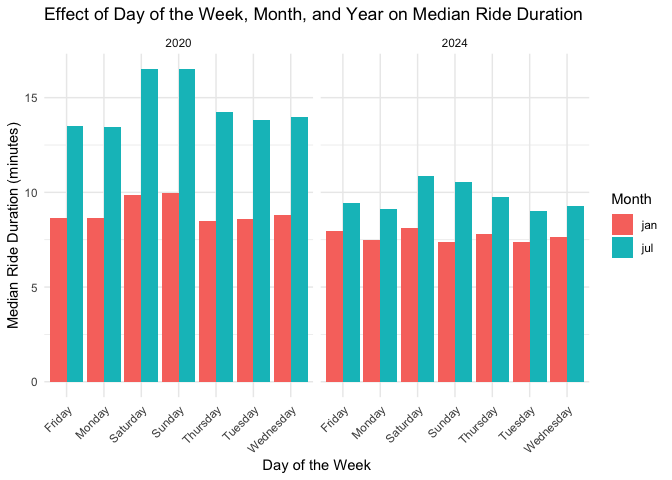

p8105_hw3_tc3326
================
KK Chen
2024-10-16

# Problem 1

## write a short description of the dataset

``` r
library(tidyverse)
```

    ## ── Attaching core tidyverse packages ──────────────────────── tidyverse 2.0.0 ──
    ## ✔ dplyr     1.1.4     ✔ readr     2.1.5
    ## ✔ forcats   1.0.0     ✔ stringr   1.5.1
    ## ✔ ggplot2   3.5.1     ✔ tibble    3.2.1
    ## ✔ lubridate 1.9.3     ✔ tidyr     1.3.1
    ## ✔ purrr     1.0.2     
    ## ── Conflicts ────────────────────────────────────────── tidyverse_conflicts() ──
    ## ✖ dplyr::filter() masks stats::filter()
    ## ✖ dplyr::lag()    masks stats::lag()
    ## ℹ Use the conflicted package (<http://conflicted.r-lib.org/>) to force all conflicts to become errors

``` r
library(p8105.datasets)

data("ny_noaa")

nrow(ny_noaa)
```

    ## [1] 2595176

``` r
ncol(ny_noaa)
```

    ## [1] 7

``` r
summary(ny_noaa)
```

    ##       id                 date                 prcp               snow       
    ##  Length:2595176     Min.   :1981-01-01   Min.   :    0.00   Min.   :  -13   
    ##  Class :character   1st Qu.:1988-11-29   1st Qu.:    0.00   1st Qu.:    0   
    ##  Mode  :character   Median :1997-01-21   Median :    0.00   Median :    0   
    ##                     Mean   :1997-01-01   Mean   :   29.82   Mean   :    5   
    ##                     3rd Qu.:2005-09-01   3rd Qu.:   23.00   3rd Qu.:    0   
    ##                     Max.   :2010-12-31   Max.   :22860.00   Max.   :10160   
    ##                                          NA's   :145838     NA's   :381221  
    ##       snwd            tmax               tmin          
    ##  Min.   :   0.0   Length:2595176     Length:2595176    
    ##  1st Qu.:   0.0   Class :character   Class :character  
    ##  Median :   0.0   Mode  :character   Mode  :character  
    ##  Mean   :  37.3                                        
    ##  3rd Qu.:   0.0                                        
    ##  Max.   :9195.0                                        
    ##  NA's   :591786

``` r
na_summary <- colSums(is.na(ny_noaa))
na_summary
```

    ##      id    date    prcp    snow    snwd    tmax    tmin 
    ##       0       0  145838  381221  591786 1134358 1134420

This dataset contains 2595176 rows and 7 columns. Key variables include
weather station id, date of observation, (tenths of mm), precipitation
(tenths of mm), snowfall (mm), snow depth (mm), and min and max daily
temperature (tenths of degrees C). The dataset contains some significant
missing data. There are 145,838 missing values for precipitation,
381,221 for snowfall, and 591,786 for snow depth.

## Data cleanning

``` r
ny_noaa %>% 
  count(snow) %>%
  arrange(desc(n))
```

    ## # A tibble: 282 × 2
    ##     snow       n
    ##    <int>   <int>
    ##  1     0 2008508
    ##  2    NA  381221
    ##  3    25   31022
    ##  4    13   23095
    ##  5    51   18274
    ##  6    76   10173
    ##  7     8    9962
    ##  8     5    9748
    ##  9    38    9197
    ## 10     3    8790
    ## # ℹ 272 more rows

``` r
ny_noaa = 
  ny_noaa %>% 
  separate(date, into = c("year", "month", "day"), convert = TRUE) %>% 
  mutate(
    tmax = as.numeric(tmax),
    tmin = as.numeric(tmin))
```

Comment:

0 mm snowfall is most common because snow is a seasonal occurrence. Most
days throughout the year, particularly in non-winter months, do not see
any snow.

Missing data (NA) for snowfall is the second most common. It may result
from days or stations where snowfall was not measured.

25 mm, 13 mm, and 51 mm are the next most common values. Light snowfall
events are more frequent than heavy snowstorms. Snowfall is often
measured in the U.S. using inches, it’s likely that these values were
recorded as fractional inches and then converted to millimeters for
consistency in this dataset.

## Make a two-panel plot showing the average max temperature in January and in July in each station across years.

``` r
average_max_tem_plot <- ny_noaa %>%
  filter(month %in% c(1, 7)) %>%  
  group_by(id, year, month) %>%
  summarize(avg_tmax = mean(tmax, na.rm = TRUE), .groups = 'drop')  

ggplot(average_max_tem_plot, aes(x = year, y = avg_tmax, color = id)) +
  geom_line(alpha = 0.7) +  
  facet_wrap(~ month) + 
  labs(
    title = "Average Maximum Temperature in January and July In Each Station Across Years",
    x = "Year",
    y = "Average Max Temperature (°C)",
    color = "Station ID"
  ) +
  theme_minimal() +
  theme(legend.position = "none") 
```

    ## Warning: Removed 5640 rows containing missing values or values outside the scale range
    ## (`geom_line()`).

<!-- -->
Comments:

In both January and July, most stations show a fairly stable trend in
maximum temperatures across the years, with some fluctuations. The
temperatures in January are generally much lower than in July,
consistent with winter and summer temperatures. Overall the trends
remain within a similar range for most stations within a month across
the years.

Some extreme negative values (below -50°C) are present in the January
panel. There is one noticeable outlier on July of 1988 and a few other
outliers in July panel.

# Problem 2

## Import and Organize data sets

``` r
library(tidyverse)
```

``` r
nhanes_accel <- read_csv("./data/nhanes_accel.csv") %>%
  janitor::clean_names()
```

    ## Rows: 250 Columns: 1441
    ## ── Column specification ────────────────────────────────────────────────────────
    ## Delimiter: ","
    ## dbl (1441): SEQN, min1, min2, min3, min4, min5, min6, min7, min8, min9, min1...
    ## 
    ## ℹ Use `spec()` to retrieve the full column specification for this data.
    ## ℹ Specify the column types or set `show_col_types = FALSE` to quiet this message.

``` r
nhanes_covar <- read_csv("./data/nhanes_covar.csv", skip = 4)%>%
 set_names(c("seqn", "sex", "age", "BMI", "education")) %>%

mutate(
    seqn = as.integer(seqn),
    sex = factor(sex, levels = c(1, 2), labels = c("Male", "Female")),
    age = as.numeric(age),
    BMI = as.numeric(BMI),
    education = factor(education, levels = c(1, 2, 3), labels = c("Less than     high school", "High school equivalent", "More than high school"))
      ) %>%
  filter(age >= 21) %>%
  drop_na(sex, age, BMI, education)
```

    ## Rows: 250 Columns: 5
    ## ── Column specification ────────────────────────────────────────────────────────
    ## Delimiter: ","
    ## dbl (5): SEQN, sex, age, BMI, education
    ## 
    ## ℹ Use `spec()` to retrieve the full column specification for this data.
    ## ℹ Specify the column types or set `show_col_types = FALSE` to quiet this message.

``` r
merged_data <- nhanes_accel %>%
  inner_join(nhanes_covar, by = "seqn")
```

## Produce a reader-friendly table for the number of men and women in each education category

``` r
merged_data %>%
  group_by(sex, education) %>%
  summarize(count = n(), .groups = 'drop') %>%
  pivot_wider(names_from = sex, values_from = count, values_fill = 0) %>%
  knitr::kable()
```

| education              | Male | Female |
|:-----------------------|-----:|-------:|
| Less than high school  |   27 |     28 |
| High school equivalent |   35 |     23 |
| More than high school  |   56 |     59 |

Comments: This table shows that both men and women in the dataset tend
to have higher education levels, with the “More than high school” group
having the highest representation for both genders. However, men are
more prevalent in the “High school equivalent” category, while the “Less
than high school” group shows an almost equal gender distribution.

## Create a visualization of the age distributions for men and women in each education category

``` r
ggplot(merged_data, aes(x = education, y = age, fill = sex)) +
  geom_boxplot(alpha = 0.7) +
  labs(
    title = "Age Distributions by Sex and Education Level",
    x = "Education Level",
    y = "Age",
    fill = "Sex"
  ) +
  theme_minimal() +
  theme(legend.position = "bottom")
```

<!-- -->
Comments: Participants with less education tend to be older, with the
“less than high school” group having the oldest participants on average.
In contrast, the “more than high school” group includes younger
participants.

In High School Equivalent,women in this group tend to be slightly older
than men, with a median age closer to 60 for women and around 55 for
men.Most women are of similar ages (closer to the median), while men
show more variability.

In More than High school, it shows the most diverse age distribution for
both men and women. It suggests that people with more than a high school
education come from a broad range of age groups.The median age for both
men and women is around 41 years, indicating that the central tendency
is similar for both genders in this education level.

## Aggregate and create a total activity variable for each participant. Plot these total activities (y-axis) against age (x-axis)

``` r
activity_age_plot <- merged_data %>%
  mutate(total_activity = rowSums(across(min1:min1440), na.rm = TRUE)) %>%
  ggplot(aes(x = age, y = total_activity, color = sex)) +
  geom_point(alpha = 0.6) +
  geom_smooth(se = FALSE) +
  facet_grid(.~ education) +
  labs(
    title = "Total Activity By Age and Education Level and Sex",
    x = "Age",
    y = "Total Activity (MIMS)",
    color = "Sex"
  ) +
  theme_minimal() +
  theme(legend.position = "bottom")

print(activity_age_plot)
```

    ## `geom_smooth()` using method = 'loess' and formula = 'y ~ x'

<!-- -->
Comment: All groups show a decline in activity with age, participants
with higher education maintain higher levels of activity into older age.
In the “Less than high school” group, physical activity decreases with
age for both men and women, particularly after age 60. In the “High
school equivalent” group, middle age women generally have higher
activity than middle age men. Activity decreases for women and men after
age 40. In the “More than high school” group, activity trends are
relatively stable across age, with men and women displaying similar
activity patterns throughout the lifespan. However, women tend to have
slightly higher activity levels than men overall. After the age of 60,
both men and women experience a gradual decrease in total activity. The
decline is more gradual compared to those with lower education levels.

## Make a three-panel plot that shows the 24-hour activity time courses for each education level and use color to indicate sex

``` r
merged_data <- merged_data %>%
  pivot_longer(cols = min1:min1440, names_to = "minute", values_to = "activity") %>%
  mutate(minute = as.numeric(gsub("min", "", minute))) %>%
  group_by(education, sex, minute) %>%
  summarize(mean_act = mean(activity, na.rm = TRUE), .groups = 'drop')
```

``` r
Hour_course_plot <- merged_data %>%
  ggplot(aes(x = minute, y = mean_act, color = sex)) +
  geom_line(alpha = 0.3) +
  geom_smooth(se = FALSE) +
  facet_grid(.~ education) +
  labs(
    title = "24-Hour Activity Time Courses by Education Level and Sex",
    x = "Minute of the Day",
    y = "Mean Activity",
    color = "Sex"
  ) +
  theme_minimal() +
  theme(legend.position = "bottom")

print(Hour_course_plot)
```

    ## `geom_smooth()` using method = 'gam' and formula = 'y ~ s(x, bs = "cs")'

<!-- -->
Comments:

Across all education levels, activity peaks in the morning (around 8
a.m.) and declines in the evening. Women generally show higher activity
levels, especially in the “High school equivalent” and “More than high
school” groups.

Less than High School: Lower overall activity. There is a sharp peak in
the morning and a steady decline throughout the day. Men show slightly
higher activity than women.

High School Equivalent: Higher and more sustained activity levels than
the Less than High School group. Women tend to have higher activity than
men, especially during mid-day.

More than High School: This group has the highest activity levels
throughout the day, with women consistently more active than men.

# Problem 3

## Import and clean datasets

``` r
library(tidyverse)
library(janitor)
```

    ## 
    ## Attaching package: 'janitor'

    ## The following objects are masked from 'package:stats':
    ## 
    ##     chisq.test, fisher.test

``` r
combined_data <- read_csv("./data/Jan 2020 Citi.csv") %>%
  mutate(month = "jan", year = 2020) %>%
  clean_names() %>%
  bind_rows(
    read_csv("./data/July 2020 Citi.csv") %>%
      mutate(month = "jul", year = 2020) %>%
      clean_names(),
    read_csv("./data/Jan 2024 Citi.csv") %>%
      mutate(month = "jan", year = 2024) %>%
      clean_names(),
    read_csv("./data/July 2024 Citi.csv") %>%
      mutate(month = "jul", year = 2024) %>%
      clean_names()
  ) %>%
  distinct() 
```

    ## Rows: 12420 Columns: 7
    ## ── Column specification ────────────────────────────────────────────────────────
    ## Delimiter: ","
    ## chr (6): ride_id, rideable_type, weekdays, start_station_name, end_station_n...
    ## dbl (1): duration
    ## 
    ## ℹ Use `spec()` to retrieve the full column specification for this data.
    ## ℹ Specify the column types or set `show_col_types = FALSE` to quiet this message.
    ## Rows: 21048 Columns: 7
    ## ── Column specification ────────────────────────────────────────────────────────
    ## Delimiter: ","
    ## chr (6): ride_id, rideable_type, weekdays, start_station_name, end_station_n...
    ## dbl (1): duration
    ## 
    ## ℹ Use `spec()` to retrieve the full column specification for this data.
    ## ℹ Specify the column types or set `show_col_types = FALSE` to quiet this message.
    ## Rows: 18861 Columns: 7
    ## ── Column specification ────────────────────────────────────────────────────────
    ## Delimiter: ","
    ## chr (6): ride_id, rideable_type, weekdays, start_station_name, end_station_n...
    ## dbl (1): duration
    ## 
    ## ℹ Use `spec()` to retrieve the full column specification for this data.
    ## ℹ Specify the column types or set `show_col_types = FALSE` to quiet this message.
    ## Rows: 47156 Columns: 7
    ## ── Column specification ────────────────────────────────────────────────────────
    ## Delimiter: ","
    ## chr (6): ride_id, rideable_type, weekdays, start_station_name, end_station_n...
    ## dbl (1): duration
    ## 
    ## ℹ Use `spec()` to retrieve the full column specification for this data.
    ## ℹ Specify the column types or set `show_col_types = FALSE` to quiet this message.

``` r
obs <- combined_data %>%
  nrow()
summary(combined_data)
```

    ##    ride_id          rideable_type        weekdays            duration      
    ##  Length:99485       Length:99485       Length:99485       Min.   :  1.002  
    ##  Class :character   Class :character   Class :character   1st Qu.:  5.595  
    ##  Mode  :character   Mode  :character   Mode  :character   Median :  9.839  
    ##                                                           Mean   : 13.930  
    ##                                                           3rd Qu.: 17.560  
    ##                                                           Max.   :238.780  
    ##  start_station_name end_station_name   member_casual         month          
    ##  Length:99485       Length:99485       Length:99485       Length:99485      
    ##  Class :character   Class :character   Class :character   Class :character  
    ##  Mode  :character   Mode  :character   Mode  :character   Mode  :character  
    ##                                                                             
    ##                                                                             
    ##                                                                             
    ##       year     
    ##  Min.   :2020  
    ##  1st Qu.:2020  
    ##  Median :2024  
    ##  Mean   :2023  
    ##  3rd Qu.:2024  
    ##  Max.   :2024

Describe the resulting dataset:

The dataset contains 99,485 Citi Bike rides from January and July of
2020 and 2024. Each ride has details such as ride ID, ride duration,
bike type, the day of the week, start and end station names, and whether
the rider is a member or casual user.

## Produce a reader-friendly table

``` r
ride_summary <- combined_data %>%
  group_by(year, month, member_casual) %>%
  summarize(total_rides = n(), .groups = 'drop') %>%
  pivot_wider(names_from = member_casual, values_from = total_rides, values_fill = 0) %>%
    adorn_totals("row")
```

``` r
print(ride_summary)
```

    ##   year month casual member
    ##   2020   jan    984  11436
    ##   2020   jul   5637  15411
    ##   2024   jan   2108  16753
    ##   2024   jul  10894  36262
    ##  Total     -  19623  79862

Comments:

The table shows that Citi Bike usage is significantly higher in July
compared to January, reflecting strong seasonal variation. Member riders
consistently account for the majority of rides, but casual ridership
also sees a notable increase during the summer. Between 2020 and 2024,
there is a marked growth in both casual and member rides. It indicates
the increasing popularity of the system, especially during warmer
months.

## Make a table showing the 5 most popular starting stations for July 2024; include the number of rides originating from these stations.

``` r
top_stations_july_2024 <- combined_data %>%
  filter(month == "jul" & year == 2024) %>%
  group_by(start_station_name) %>%
  summarize(total_rides = n(), .groups = 'drop') %>%
  arrange(desc(total_rides)) %>%
  slice_head(n = 5)  
```

``` r
top_stations_july_2024 %>%
  knitr::kable(col.names = c("Start Station", "Total Rides"), 
               caption = "Top 5 Most Popular Starting Stations for July 2024")
```

| Start Station            | Total Rides |
|:-------------------------|------------:|
| Pier 61 at Chelsea Piers |         163 |
| University Pl & E 14 St  |         155 |
| W 21 St & 6 Ave          |         152 |
| West St & Chambers St    |         150 |
| W 31 St & 7 Ave          |         146 |

Top 5 Most Popular Starting Stations for July 2024

## Make a plot to investigate the effects of day of the week, month, and year on median ride duration.

``` r
median_duration_data <- combined_data %>%
  group_by(year, month, weekdays) %>%
  summarize(median_duration = median(duration, na.rm = TRUE), .groups = 'drop')

ggplot(median_duration_data, aes(x = weekdays, y = median_duration, fill = month)) +
  geom_bar(stat = "identity", position = "dodge") +  
  facet_wrap(~ year) +  
  labs(
    title = "Effect of Day of the Week, Month, and Year on Median Ride Duration",
    x = "Day of the Week",
    y = "Median Ride Duration (minutes)",
    fill = "Month"
  ) +
  theme_minimal() +
  theme(axis.text.x = element_text(angle = 45, hjust = 1))  
```

<!-- -->
Comments:

Across both 2020 and 2024 years, July consistently shows higher median
ride durations compared to January.

Weekend Days (Saturday and Sunday) tend to have the longest median ride
durations, especially in July. Weekdays generally see shorter median
ride durations.

2020 year shows a sharper contrast between weekend and weekday ride
durations compared to 2024, especially in July, where weekend ride
durations are significantly higher.

## For data in 2024, make a figure that shows the impact of month, membership status, and bike type on the distribution of ride duration.

``` r
distribution_2024_plot <- combined_data %>%
  filter(year == 2024)

ggplot(distribution_2024_plot, aes(x = duration, fill = member_casual)) +
  geom_histogram(binwidth = 10, position = "dodge", alpha = 0.8) +  
  facet_grid(month ~ rideable_type) +  
  labs(
    title = "Ride Distribution of Ride Duration by Month, Membership Status, and Bike Type in 2024",
    x = "Ride Duration (minutes)",
    y = "Count",
    fill = "Member/Casual"
  ) +
  theme_minimal()
```

<!-- -->
Comments:

Members have shorter ride durations compared to casual riders across
both classic and electric bikes. This trend is visible in both January
and July for electric bikes. Casual riders tend to have a wider spread
in ride durations

Electric bikes show a concentration of rides with very short durations
among members.Classic bikes tend to have a slightly more distributed
ride duration pattern.

July sees more rides overall compared to January, which aligns with
seasonal patterns where summer months attract more bike riders, both
casual and member. Casual riders in July tend to have longer ride
durations compared to January for classic bikes.
